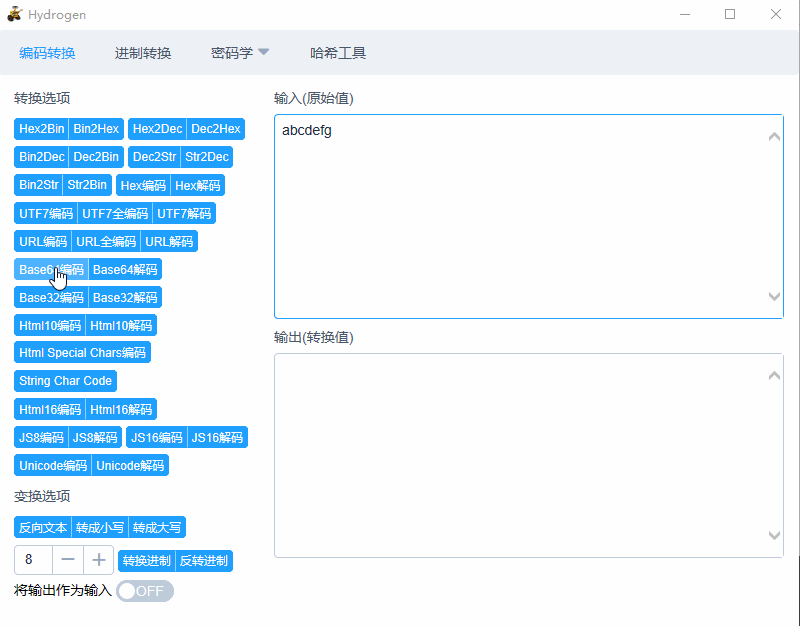

# hydrogen

在做 CTF 的过程中，有一些编码转换等功能经常要使用，但是网上的各种工具都没有较满意的，而且也不能自定义一些功能，因此就有了这样一个项目，类似的项目还有[CTFCrackTools](https://github.com/0Chencc/CTFCrackTools)。

这个工具使用了 Web 技术来实现，界面使用 Vue + Element 写的，后端使用 Flask，在 Python 3.5 环境下，使用 [pywebview](https://github.com/r0x0r/pywebview) 实现窗口程序。

前端界面的项目地址: [hydrogen-fe](https://github.com/restran/hydrogen-fe)




## Build Windows Binary

Windows 环境下可以使用 pyinstaller 打包成一个文件

    pyinstaller --onefile main.py

打包成一个文件，不显示控制台，设置图标

    pyinstaller --onefile --windowed --icon=assets/icon.ico main.py

## Build Mac Binary

Mac 环境下可以使用 [py2app](https://pypi.python.org/pypi/py2app/) 来打包，可以参考[这篇文章](http://www.jianshu.com/p/afb6b2b97ce9)

py2app 提供了“别名模式”，该模式通过与开发文件象征性的链接构建应用，测试和开发的时候使用。

    python3 py2app_setup.py py2app -A

构建发布应用

    rm -rf build dist
    python3 py2app_setup.py py2app
    
图标要使用 icns 格式 [IconFinder](https://www.iconfinder.com/) 和 [freepik](http://www.freepik.com/free-icons) 下载

## 常见问题

使用 pyinstaller 打包时出现 jinja2 问题，导致运行后的程序无法创建 flask web server

```
Syntax error in  c:\python35\lib\site-packages\jinja2\asyncsupport.py
("'yield' inside async function", ('c:\\python35\\lib\\site-packages\\jinja2\\asyncsupport.py', 35, 12, '            yield event\n'))
```

https://stackoverflow.com/questions/43163201/pyinstaller-syntax-error-yield-inside-async-function-python-3-5-1

jinja2 2.9.6 版本会有此问题，可以使用 jinja2==2.8.1 或者使用 pyinstaller 3.3 以上版本


## 类似项目

- [CTFCrackTools](https://github.com/0Chencc/CTFCrackTools)

## 致谢

- phith0n: [tool-playground](https://github.com/phith0n/tool-playground)
- hustcc: [xmorse](https://github.com/hustcc/xmorse)
